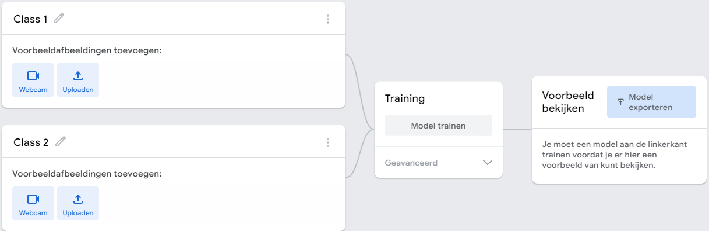
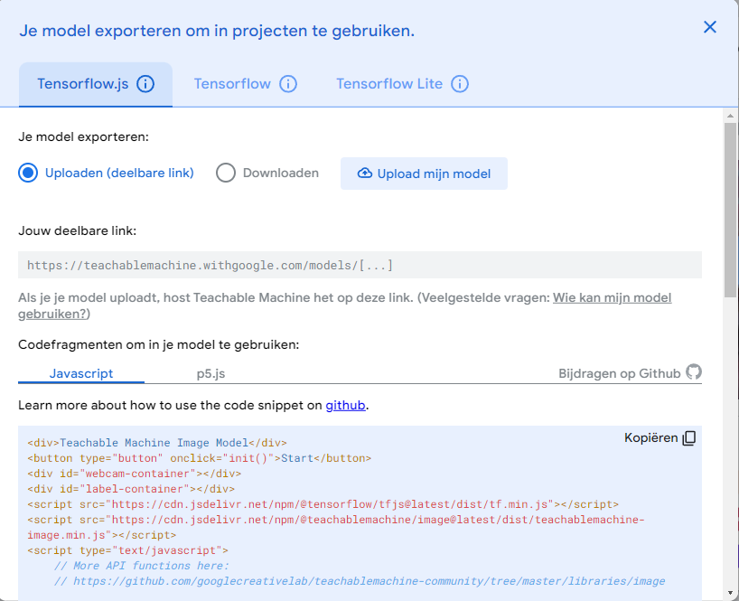
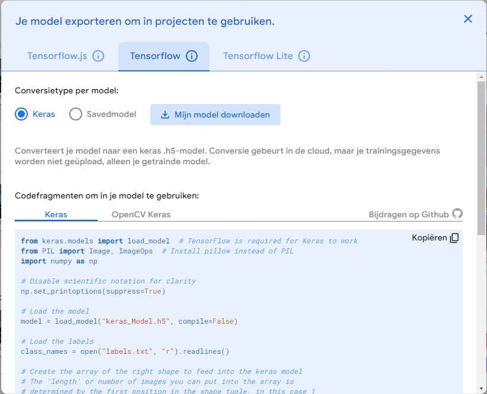
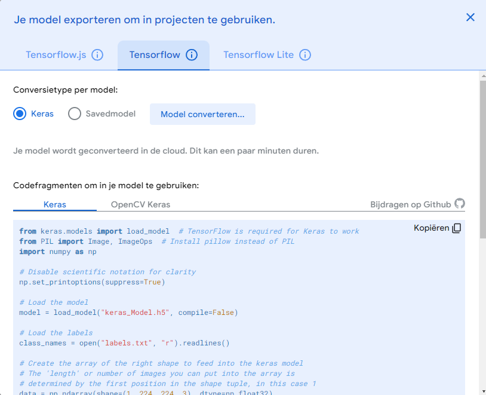
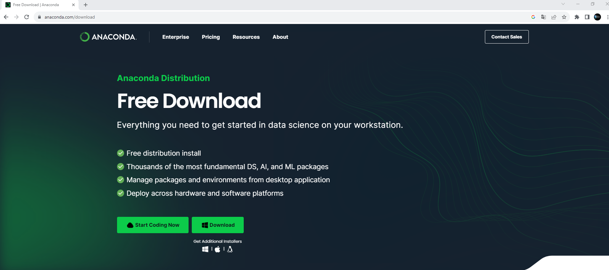
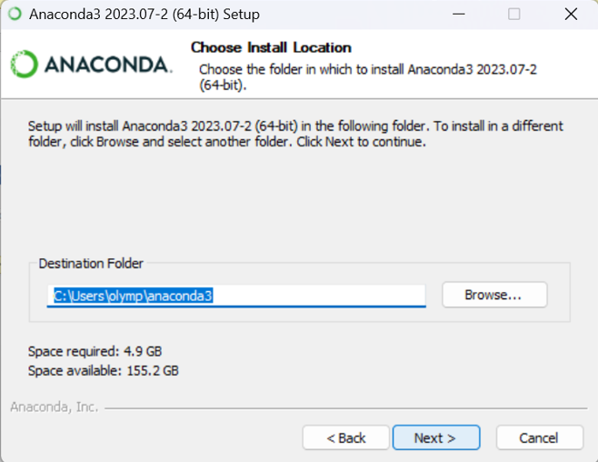
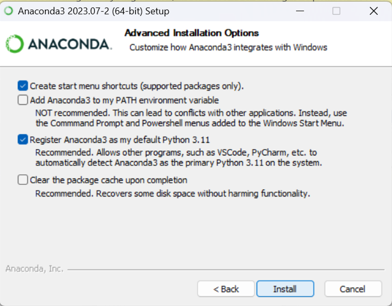
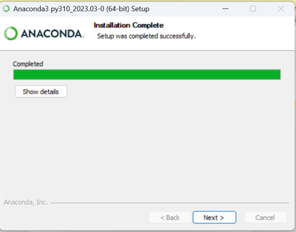
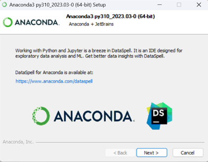

# Hands on AI in STEM

## Intro

Hier zal gebruik gemaakt worden van AI om een servomotor op de micro:bit aan te sturen. Er zal eerst een neuraal netwerk getraind worden met beelden. Beelden die we verzamelen via de webcam van de computer. Hoe meer beelden we nemen, hoe preciezer het neuraal netwerk zal werken. Binnen het neuraal netwerk (NN) zullen we een aantal klasse's opnemen (classificatie). Hoeveel klasses je nodig hebt hangt af van de toepassing. De aangeboden train beelden zullen we zelf toekennen aan een klasse. We werken hier dus met een **Supervised learning AI model** werken. De data geven we aan het NN en bij die data zeggen we (per beeld hier) het NN tot welk een klasse de data behoort. 

Het neuraal netwerk (NN) zal patronen zoeken en onderscheiden die specifiek zijn voor een bepaalde klasse.

Eenmaal het neuraal netwerk getraind is kunnen we dan een nieuw beeld aanbieden aan het NN die dan een beoordeling zal maken en een procentuele kanswaarde zal genereren voor iedere klasse. De hoogste procentuele waarde zal bepalend zijn om het beeld tot die klasse onder te brengen. Let wel het nieuwe beeld levert geen meerwaarde aan het leerproces van het NN. Indien er geen voldoening is door de gebruiker dringt zich een nieuwe leerfase op met betere/meer traindata. 

> Het is dus duidelijk dat we zelf het NN niet zullen bouwen, maar we gebruiken een leeg bestaand NN om met onze specifieke data dit NN te trainen volgens onze toepassing. Wil je een nieuwe toepassing, dan kan je dit opnieuw doen met andere data.

Eenmaal we tevreden zijn van het getrainde NN (we zullen het ook testen, wat ook een belangrijke stap is in het gebruik van AI) gaan we dit volledige NN downloaden als een bestand op onze computer. Aan dit bestand kunnen we dan nieuwe data aanbieden, waarop het NN dan zijn werk zal doen en een output (procentuele classificatie).

Om dit te kunnen doen zullen we een beetje moeten programmeren. En python is hiervoor uitstekend geschikt. In dit programma zullen we toelaten dat we nieuwe data kunnen binnenhalen (in ons geval webcam beelden) en dat we die nieuwe data kunnen aanbieden aan het bestand met daarin ons getraind NN. Dit zal dus een output generen volgens de klasses die we in het NN hebben opgenomen. Daaruit zullen we de klasse halen die de hoogste 'confidence score' bezit. 

Ons python programma zal dan ook in staat moeten zijn om te kunnen communiceren met de microcontroller. In ons geval de Micro:Bit. Het python programma kan dan een unieke waarde doorsturen naar de microcontroller. De microcontroller kan die waarde binnen lezen en interpreteren. Volgens de interpretatie kan de microcontroller dan een actuator aansturen, in ons geval zullen dit enkele led's zijn op de ledmatrix van de Micro:Bit. Andere actuatoren zijn dan natuurlijk ook mogelijk.


## Stappenplan

Om een overzicht te houden volgt hier een opsomming van de te nemen stappen:
<ol>
<li>beelden verzamelen om het NN te trainen = train data (via webcam)</li>
<li>beelden classificeren</li>
<li>NN trainen</li>
<li>NN downloaden als bestand</li>
<li>python script schrijven met volgend stappenplan: </li>
<ol>
    <li>NN bestand importeren en gebruiken</li>
    <li>nieuwe webcam beelden kan aanleveren aan NN</li>
    <li>output van NN kan lezen en interpreteren</li>
    <li>communiceren met een microcontroller</li>
    <li>output van NN doorsturen naar microcontroller</li>
</ol>
<li>microcontroller leest data binnen</li>
<li>microcontroller stuurt actuator aan</li>
</ol>

We bespreken in volgende hoofdstukken deze stappen in detail. We gaan hier een voorbeeld uitwerken waarbij we met 3 klasses zullen werken:

<ul>
<li>klasse1 : beelden met een duim omhoog</li>
<li>klasse2 : beelden met een duim omlaag</li>
<li>klasse0 : beelden zonder zichtbare duim (of iets die niet klasse1 en niet klasse2 is)</li>
</ul>

Op basis van die beelden (classificaties) willen we de positie van een servo motor aansturen in drie posities: 

<ul>
<li>klasse1 : Led2 aan</li>
<li>klasse2 : Led3 aan</li>
<li>klasse0 : Led1 aan</li>
</ul>

<hr>

## Beelden verzamelen om het NN te trainen = train data (via webcam)

Hiervoor gebruiken we een online platform van Google. Dit platform voorziet lege neurale netwerken die je met uw eigen data kan trainen. Nadien kan je ook testen of uw NN geschikt is voor gebruik. Het platform is 'Teachable Machine' en is te vinden op:

<https://teachablemachine.withgoogle.com/>


Je hebt hiervoor een Google-account nodig. Log met die account in op 'Teachable Machine'. Nu kan je kiezen wat voor soort train-, test- en verwerk data je wenst te gebruiken. 

Klik op de knop "Aan de slag"


## Beelden classificeren

De gemaakte beelden zijn onmiddelijk in drie klasses gestopt volgens inhoud van de foto's:

<ul>
<li>klasse1 : beelden met een duim omhoog</li>
<li>klasse2 : beelden met een duim omlaag</li>
<li>klasse0 : beelden zonder zichtbare duim (of iets die niet klasse1 en niet klasse2 is)</li>
</ul>





## Neuraal netwerk trainen


Na het train proces kan er op de website onmidellijk worden getest met nieuwe data (nieuwe beelden). Ga hier na of in alle omstandigheden het neuraal netwerk goed reageert en classificeert. Indien dit niet ok is kan er opnieuw worden getraind met nieuwe / extra data. 


Eenmaal dit goed bevonden, kan dit worden opgeslagen in uw Google account. Dit is handig als er achteraf toch nog nieuwe trainingsdata zou moeten bijkomen. Je kan verschillende van die getrainde NN op de website opslaan.


## Volledig getraind Neuraal Netwerk downloaden als bestand

Het volledige getraind neuraal netwerk kan nu als bestand worden gedownload. Let wel, niet alle getrainde fotodata is hierin opgeslagen. Wel de herkende patronen die het NN toelaten om er een classificatie van te maken. Vandaar dat dit bestand niet zo groot is als je op eerste zicht zou verwachten.

Klik op Model exporteren



Er zijn verschillende manieren om van dit NN een bestand te maken. Het Google model die hier gebruikt wordt is een Keras model van Tensorflow. Tensorflow is een Google onderdeel die zich specialiseert in AI. Op de website kunnen we dit NN als een keras model van Tensorflow downloaden. 

Klik hiervoor op het middelste tabblad "Tensorflow" en zet de radiobutton op Keras.



Klik nu op de knop "Mijn model downloaden". Teachable Machine zal het model converteren naar een Keras model en het inpakken in een ZIP bestand.



Dit levert een ZIP bestand (converted_keras.zip) op dat je op uw lokale computer kan bewaren en uitpakken.


In het ZIP bestand zitten twee bestanden:


Het ene bestand is het NN 'keras_model.h5' bestand. Het volledige getrainde NN zit vervat in dit bestand.
Het andere bestand "labels.txt" bevat enkel de namen van de klasses.


## Python script schrijven

Nu moet er op de lokale computer een Python script wordt geschreven die volgende zaken doet:

<ol>
    <li>NN bestand importeren en gebruiken</li>
    <li>nieuwe webcam beelden kan aanleveren aan NN</li>
    <li>output van NN kan lezen en interpreteren</li>
    <li>communiceren met een microcontroller</li>
    <li>output van NN doorsturen naar microcontroller</li>
</ol>

Hiervoor wordt best gebruik gemaakt van een Python IDE (ontwikkelomgeving). Er wordt hier gebruik gemaakt van Spyder. Dit wordt best geïnstalleerd onder het pakket van Anaconda.



Ga naar de website van Anaconda en download de installer van Anaconda. Na het downloaden voer de installer uit:


Volg daarna standaard stappen (§zorg dat je Administrator rechten hebt op de computer!!):












Sluit de browser

Laat Anaconda Navigator opstarten


Kies voor No, don't show again


Het is niet nodig om een account te hebben. Sluit venster in het kruisje.


## Installatie van Tensorflow, OpenCV en PySerial python bibliotheken

Deze bibliotheek is nodig om het gedownloade NN van Teachable Machine te kunnen verwerken binnen een lokaal python omgeving (environment).
De installatie gaat als volgt: Klik op de CMD.exe Prompt binnen de Anaconda Navigator:


Op de prompt typen we de regel gevolgd door Enter:

```prompt
conda create -n tf tensorflow
```


Type y en druk op Enter


Type dan op de prompt gevolgd door Enter: 

```prompt
conda activate tf
```


:::warning
Tensorflow heeft nu binnen python een nieuw environment aangemaakt. Alle andere bibliotheken en ook het opstarten van Spyder moet nu binnen dit environment gebeuren. Je ziet nu trouwens dat uw prompt niet meer begint met base maar met tf, wat de naam van het environment is.
:::

Type dan op de prompt gevolgd door Enter: 

```prompt
pip install opencv-python
```


Installeer nu nog eens volgende bibliotheek. Deze is nodig om later een communicatie te leggen met de microprocessor (verbonden met een USB kabel aan de computer)

```prompt
conda install -c anaconda pyserial
```

Bevestig tussendoor met een y.

***

Sluit het prompt venster en selecteer in de Anaconda Navigator het tf environment:


Install Spyder onder de tf environment:


En Launch Spyder na installatie na opnieuw het sluiten van het update venster.


Sluit venstertje met Tour optie


Voila, de computer is klaar om een python script, met daarin het gebruik van een Keras Tensorflow AI Neuraal Netwerk bestand en via Opencv kan het script de webcam gebruiken, te schrijven en te testen. De bibliotheek PySerial is nodig om verder een communicatie te verzorgen tussen de computer en de Micro:Bit.

## Python script zonder micro:bit

De werking van OpenCV en het neuraal netwerk kan getest worden adhv volgend script. Start binnen Anaconda Navigator de Spyder IDE op. Spyder is een python editor waarbinnen python code kan worden geschreven.

Het is hier niet de bedoeling om qua python kennis alles uit de doeken te doen. Een zeer beperkte bespreking van de werking van het script zal hier worden uitgevoerd. Bij verdere interesse in de werking van python en spyder wordt hier verwezen naar aparte opleiding hieromtrent.

:::warning
Zorg in eerste instantie dat je een aparte map hebt gemaakt op uw computer waar alle bestanden omtrent dit script in zullen worden verzameld. Hierin komen al zeker de twee bestanden die je uit het ZIP bestand hebt gehaald ("labels.txt", "keras_model.h5"). Zorg er ook voor dat het nieuwe aangemaakte py-bestand binnen Spyder ook in die map wordt bewaard.
:::

Geef het py-bestand een eigen naam en sla op. Let op, zoals eerder aangegeven, sla dit bestand zeker op in de map waar ook de gedownloade Teachable Machine bestanden zijn opgeslagen. 

```python
#Imports
import numpy as np
import cv2  # Bibliotheek om webcam te gebruiken
from keras.models import load_model # Bibliotheek om NN-bestand te gebruiken

cap = cv2.VideoCapture(0)  #Variabele om webcam beeld in op te slaan

model = load_model('keras_model.h5') #Variabele waarin NN-bestand wordt gelezen

while True:
    succes, image = cap.read() #beeld opvragen aan Webcam
    if succes == True:  #indien beeld is verkregen van de webcam
        
        cv2.imshow("Frame",image) #Toon het beeld in een venster
        img=cv2.resize(image,(224,224)) #Beeld wat aanpassen
        img=np.array(img,dtype=np.float32) #Beeld data omvormen naar een formaat die NN-bestand kan lezen
        img=np.expand_dims(img, axis=0) #Beeld data omvormen naar een formaat die NN-bestand kan lezen
        img=img/255 #Beeld data omvormen naar een formaat die NN-bestand kan lezen
        prediction = model.predict(img) #aangepaste beeld data aanbieden aan NN en opvangen output NN in variabele
        predicted_class=np.argmax(prediction[0], axis=-1) #variabele laden met klasse (hoogste kans) uit vorige variabele 
        
        print(predicted_class) #printen naar console van klasse met hoogste kans
   
    if cv2.waitKey(1) & 0xFF == ord('q'): #programma stoppen door q te drukken na selectie webcam venster
        
        break
    
cap.release()
cv2.destroyAllWindows()
```

Met dit script, kan al onmiddelijk worden getest. In de console van Spyder, waar printcommando's hun visualisatie hebben, kan het resultaat geïnterpreteerd worden. Onderaan het script kan men zien dat met de toets q het script kan stoppen.

***
We bemerken, hier in dit voorbeeld, dat er 3 klasses zijn. De klasse met de hoogste waarschijnlijkheid wordt geselecteerd en wordt in de variabele "predicted_class" weggeschreven.


## Python script met micro:bit

Eenmaal vorige werkt, kunnen we vanuit het python script na de predict, het resultaat doorsturen naar de micro:bit. Dit doen we door een uniek karakter door te sturen op basis van het predict resultaat van het NN. Afhankelijk van het aantal klasses doen we dit hier met een '0' of '1' of '2' door te sturen naar de micro:bit. Dit doen we via een serieële verbinding via de USB kabel waarmee de micro:bit is verbonden met de computer waarop het NN draait. 

:::tip
Om dit te kunnen doen moeten we de **COM-poort nummer** kennen waarmee de Micro:Bit is verbonden met de computer. Dit kan telkens anders zijn!!
Dit kan je controleren via het Configuratie scherm van de computer. (Hardware en geluiden => Apparaatbeheer => Poorten (COM&LPT)).
:::

In volgend voorbeelden is de Micro:Bit verbonden via COM5.

### Micro:Bit code

Natuurlijk moet er dan nog op de Micro:Bit ook code draaien die deze karakters kan binnenlezen en op basis daarvan worden specifieke LED's op de ledmatrix van de Micro:Bit aangestuurd. (theorie en praktijk omtrent de Micro:Bit, zie gedeelte micro:bit).

De Micro:Bit code ziet er zo uit:

```python
# Imports go at the top
from microbit import *

while True:     #oneindige loop maken
    print('Nummer(0,1,2)? + Enter:')
    name = input()  #een binnengekomen karakter, via de USB-kabel, opslaan in variabele name
                    #variabele name is van het type char
    if name == '0': #is binnengekomen char een 0?
        display.clear() #ja, dan clear alle leds
        display.show(0) #toon 0 op Ledmatrix
        
    if name == '1': #is binnengekomen char een 1?
        display.clear()#ja, dan clear alle leds
        display.show(1) #toon 1 op Ledmatrix
        
    if name == '2': #is binnengekomen char een 2?
        display.clear() #ja, dan clear alle leds
        display.show(2) #toon 2 op Ledmatrix
        
```

Om vorige code beter te begrijpen kunnen we binnen de Micro:Bit Python programmeeromgeving dit al eens testen. Binnen die programmeeromgeving zit namelijk een terminal programma. Dit is eigenlijk een programma die op de laptop draait en kan communiceren via COM-poorten (bidirectioneel). Eenmaal de vorige code gedownload is in de Micro:Bit (dan voert deze het programma onmiddelijk uit), staat de Micro:Bit te wachten tot er een karakter via de USB kabel binnenkomt. 

Open dan het terminal venster :


Klik nu in het zwarte kader en geef een getal (0, 1 of 2) in via het toetsenbord. Er gebeurt niets tot je op ENTER drukt. Dan zal de respectievelijke LED oplichten. 

:::tip
Er moet dus een ENTER volgen op een doorgestuurd karakter!!!
:::

Nu zal dit getal moeten afkomstig zijn van het NN (predicted_class) via een Spyder python script.

:::warning
Sluit nu zeker het online programma van Micro:Bit af. Want een COM-poort kan slechts één keer door een programma worden gebruikt!!!
:::

Om dit al eens te testen binnen Syder zonder het NN kan volgend nieuw python script worden geschreven. Probeer dit te begrijpen:

```python
import serial  # Bibliotheek om communicatie te maken met de Micro:Bit

ser=serial.Serial('COM5',baudrate=115200) #instellingen voor de communicatie met de Micro:Bit

ser.write(bytearray('0\r\n','ascii')) #stuur een 0 naar de Micro:Bit

ser.close() #Sluiten van de seriële poort!!!

```
:::tip
Kijk naar de Micro:Bit. Wat zie je? Welke LED licht op? Pas bovenstaande code aan zodat een andere LED oplicht.
:::

:::warning
Let op het statement ser.close(). Dit is noodzakelijk omdat door het schrijven naar de COM-poort, die poort wordt geopend. Echter kan die slechts éénmaal worden geopend. Indien dit statement er niet zou staan, dan zou het programma de eerste keer werken, maar de volgende keren niet meer omdat de poort nog geopend staat. Oplossing is dan de Micro:Bit te disconnecteren en terug te connecteren via de USB kabel in en uit te trekken.
:::


### Laptop Python code

Het python script op de computer ziet er dan als volgt uit en is bijna hetzelfde als het vorige script. Enkel zijn er nu commando's bijgekomen die de communicatie verzorgen met de Micro:Bit.

:::warning
Let op, de manier om dit programma te beëindigen is van groot belang. Sluit het programma steeds af door in het venster met het webcam beeld de toets 'q' in te drukken!!! Hierdoor wordt ook de COM-poort met de Micro:Bit terug gesloten, zodat de volgende uitvoer van het programma de poort terug kan worden geopend, zie ook vorige Warning.
:::


```python
#Imports
import numpy as np
import cv2  # Bibliotheek om webcam te gebruiken
from keras.models import load_model # Bibliotheek om NN-bestand te gebruiken

import serial  # Bibliotheek om communicatie te maken met de Micro:Bit

cap = cv2.VideoCapture(0)  #Variabele om webcam beeld in op te slaan

model = load_model('keras_model.h5') #Variabele waarin NN-bestand wordt gelezen
ser=serial.Serial('COM5',baudrate=115200) #instellingen voor de communicatie met de Micro:Bit
while True:
    succes, image = cap.read() #beeld opvragen aan Webcam
    if succes == True:  #indien beeld is verkregen van de webcam
        
        cv2.imshow("Frame",image) #Toon het beeld in een venster
        img=cv2.resize(image,(224,224)) #Beeld wat aanpassen
        img=np.array(img,dtype=np.float32) #Beeld data omvormen naar een formaat die NN-bestand kan lezen
        img=np.expand_dims(img, axis=0) #Beeld data omvormen naar een formaat die NN-bestand kan lezen
        img=img/255 #Beeld data omvormen naar een formaat die NN-bestand kan lezen
        prediction = model.predict(img) #aangepaste beeld data aanbieden aan NN en opvangen output NN in variabele
        predicted_class=np.argmax(prediction[0], axis=-1) #variabele laden met klasse (hoogste kans) uit vorige variabele 
        
        print(predicted_class) #printen naar console van klasse met hoogste kans
        if predicted_class == 0: #is die klasse 0? 
            ser.write(bytearray('0\r\n','ascii')) #ja, stuur dan een 0 naar de Micro:Bit
        if predicted_class == 1: #is die klasse 1? 
            ser.write(bytearray('1\r\n','ascii')) #ja, stuur dan een 1 naar de Micro:Bit
        if predicted_class == 2: #is die klasse 2? 
            ser.write(bytearray('2\r\n','ascii')) #ja, stuur dan een 2 naar de Micro:Bit
            
        
    if cv2.waitKey(1) & 0xFF == ord('q'): #programma stoppen door q te drukken na selectie webcam venster
        ser.close() #sluiten van de verbinding met de Micro:Bit
        break
    
cap.release()
cv2.destroyAllWindows()
```


<hr>

Voila, dit is de volledige werking van AI Powered STEM
	
***
