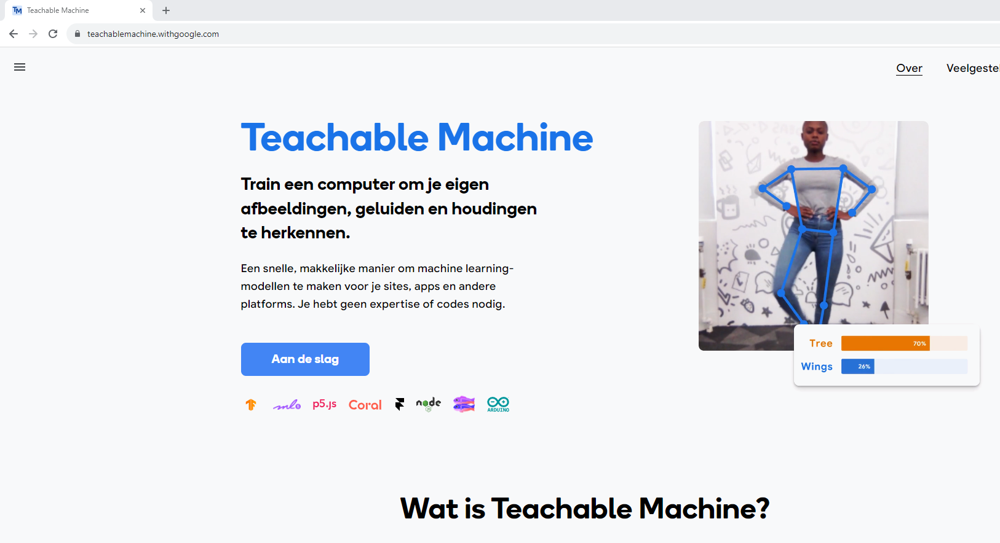
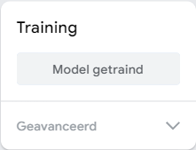
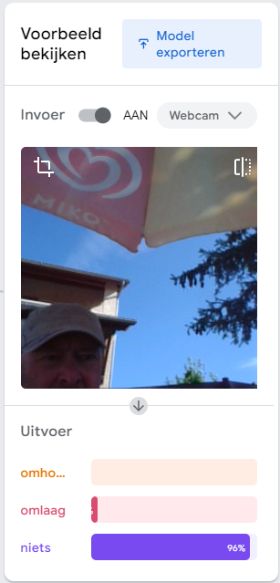

---
mathjax:
  presets: '\def\lr#1#2#3{\left#1#2\right#3}'
---

# Hands on AI in STEM

## Intro

Hier zal gebruik gemaakt worden van AI om een servomotor op de micro:bit aan te sturen. Er zal eerst een neuraal netwerk getraind worden met beelden. Beelden die we verzamelen via de webcam van de computer. Hoe meer beelden we nemen, hoe preciezer het neuraal netwerk zal werken. Binnen het neuraal netwerk (NN) zullen we een aantal klasse's opnemen (classificatie). Hoeveel klasses je nodig hebt hangt af van de toepassing. De aangeboden train beelden zullen we zelf toekennen aan een klasse. We werken hier dus met een **Supervised learning AI model** werken. De data geven we aan het NN en bij die data zeggen we (per beeld hier) het NN tot welk een klasse de data behoort. 

Het neuraal netwerk (NN) zal patronen zoeken en onderscheiden die specifiek zijn voor een bepaalde klasse.

Eenmaal het neuraal netwerk getraind is kunnen we dan een nieuw beeld aanbieden aan het NN die dan een beoordeling zal maken en een procentuele kanswaarde zal genereren voor iedere klasse. De hoogste procentuele waarde zal bepalend zijn om het beeld tot die klasse onder te brengen. Let wel het nieuwe beeld levert geen meerwaarde aan het leerproces van het NN. Indien er geen voldoening is door de gebruiker dringt zich een nieuwe leerfase op met betere/meer traindata. 

> Het is dus duidelijk dat we zelf het NN niet zullen bouwen, maar we gebruiken een leeg bestaand NN om met onze specifieke data dit NN te trainen volgens onze toepassing. Wil je een nieuwe toepassing, dan kan je dit opnieuw doen met andere data.

Eenmaal er tevredenheid is van het getrainde NN (we zullen het ook testen, wat ook een belangrijke stap is in het gebruik van AI) gaan we dit volledige NN gebruiken om de Micro:Bit aan te sturen die op zijn beurt een actuator zal aansturen. Dit kan op twee manieren. er wordt een onderscheid gemaakt hoe de gebruiker de Micro:Bit wenst te programmeren. De Micro:bit kan geprogrogrammeerd worden in blokken code of in micro-python. Er kan dus hier voor twee werkwijzen worden gekozen:

> - Programmeer de Micro:Bit in blokken
> - Programmeer de Micro:Bit in micro-python

## Stappenplan Micro:Bit in blokken

Het NN wordt in de cloud als weblink bewaard. Een speciaal ontwikkelde website kan webcambeelden doorsturen naar het NN en het resultaat ervan doorsturen naar de Micro:Bit. Het enige wat hier aan programmatie moet gebeuren is de Micro:Bit in blokken voorzien van de juiste code om de classificaties te lezen en een actuator aansturen.

Om een overzicht te houden volgt hier een opsomming van de te nemen stappen:
<ol>
<li>beelden verzamelen om het NN te trainen = train data (via webcam)</li>
<li>beelden classificeren</li>
<li>NN trainen</li>
<li>NN testen</li>
<li>NN in de cloud bewaren en de link ernaartoe kopieren</li>
<li>Programmeer de Micro:Bit in blokken</li>
<li>Open de website en maak verbinding met NN</li>
<li>Maak met de website een verbinding met de Micro:Bit</li>
<li>Laat de website nieuwe webcam beelden verwerken en de Micro:Bit actuatoren worden aangestuurd</li>
</ol>

## Stappenplan Micro:Bit in micro-python

Het NN wordt als bestand gedownload op de computer. Aan dit bestand kunnen we dan nieuwe data (via de webcam van de computer) aanbieden, waarop het NN dan zijn werk zal doen en een output (procentuele classificatie).

Om dit te kunnen doen zullen we een beetje moeten programmeren (hiervoor moet er wat software worden geïnstalleerd op de computer). En python is hiervoor uitstekend geschikt. In dit programma zullen we toelaten dat we nieuwe data kunnen binnenhalen (in ons geval webcam beelden) en dat we die nieuwe data kunnen aanbieden aan het bestand met daarin ons getraind NN. Dit zal dus een output generen volgens de klasses die we in het NN hebben opgenomen. Daaruit zullen we de klasse halen die de hoogste 'confidence score' bezit. 

Ons python programma zal dan ook in staat moeten zijn om te kunnen communiceren met de microcontroller. In ons geval de Micro:Bit. Het python programma kan dan een unieke waarde doorsturen naar de microcontroller. De microcontroller kan die waarde binnen lezen en interpreteren. Volgens de interpretatie kan de microcontroller dan een actuator aansturen, in ons geval zullen dit enkele led's zijn op de ledmatrix van de Micro:Bit. Andere actuatoren zijn dan natuurlijk ook mogelijk.

Om een overzicht te houden volgt hier een opsomming van de te nemen stappen:
<ol>
<li>beelden verzamelen om het NN te trainen = train data (via webcam)</li>
<li>beelden classificeren</li>
<li>NN trainen</li>
<li>NN testen</li>
<li>NN downloaden als bestand</li>
<li>python script schrijven met volgend stappenplan: </li>
<ol>
    <li>NN bestand importeren en gebruiken</li>
    <li>nieuwe webcam beelden kan aanleveren aan NN</li>
    <li>output van NN kan lezen en interpreteren</li>
    <li>communiceren met een microcontroller</li>
    <li>output van NN doorsturen naar microcontroller</li>
</ol>
<li>microcontroller leest data binnen</li>
<li>microcontroller stuurt actuator aan</li>
</ol>

We bespreken in volgende hoofdstukken deze stappen in detail. We gaan hier een voorbeeld uitwerken waarbij we met 3 klasses zullen werken:

<ul>
<li>klasse1 : beelden met een duim omhoog</li>
<li>klasse2 : beelden met een duim omlaag</li>
<li>klasse0 : beelden zonder zichtbare duim (of iets die niet klasse1 en niet klasse2 is)</li>
</ul>

Op basis van die beelden (classificaties) willen we een actuator aansturen op de Micro:Bit (Leds's) 

<ul>
<li>klasse1 : Led2 aan</li>
<li>klasse2 : Led3 aan</li>
<li>klasse0 : Led1 aan</li>
</ul>

## Beelden verzamelen om het NN te trainen = train data (via webcam)

Hiervoor gebruiken we een online platform van Google. Dit platform voorziet lege neurale netwerken die je met uw eigen data kan trainen. Nadien kan je ook testen of uw NN geschikt is voor gebruik. Het platform is 'Teachable Machine' en is te vinden op:

<https://teachablemachine.withgoogle.com/>

Je hebt hiervoor een Google-account nodig. Log met die account in op 'Teachable Machine'. Nu kan je kiezen wat voor soort train-, test- en verwerk data je wenst te gebruiken. 

Klik op de knop "Aan de slag"

## Beelden classificeren

De gemaakte beelden zijn onmiddelijk in drie klasses gestopt volgens inhoud van de foto's:

<ul>
<li>klasse1 : beelden met een duim omhoog</li>
<li>klasse2 : beelden met een duim omlaag</li>
<li>klasse0 : beelden zonder zichtbare duim (of iets die niet klasse1 en niet klasse2 is)</li>
</ul>

## Neuraal netwerk trainen en testen

Na het train proces kan er op de website onmidellijk worden getest met nieuwe data (nieuwe beelden). Ga hier na of in alle omstandigheden het neuraal netwerk goed reageert en classificeert. Indien dit niet ok is kan er opnieuw worden getraind met nieuwe / extra data. 

Eenmaal dit goed bevonden, kan dit worden opgeslagen in uw Google account. Dit is handig als er achteraf toch nog nieuwe trainingsdata zou moeten bijkomen. Je kan verschillende van die getrainde NN'n op de website of op uw computer opslaan.

