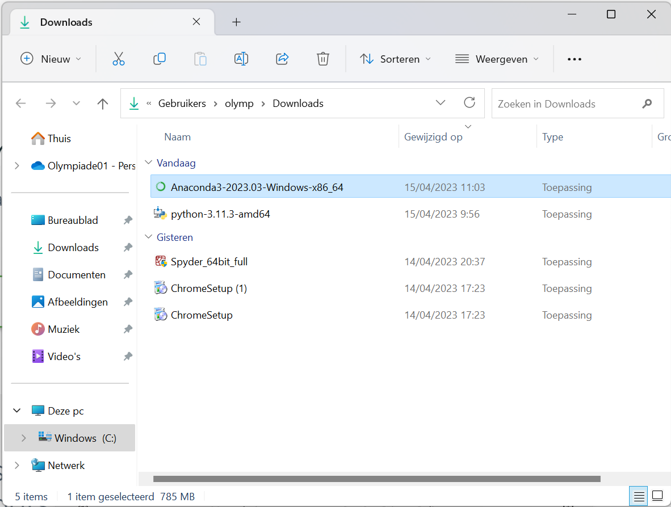
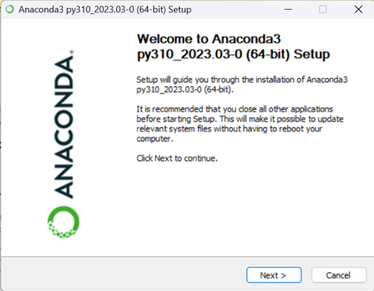
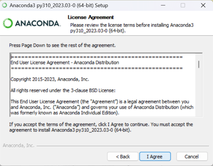
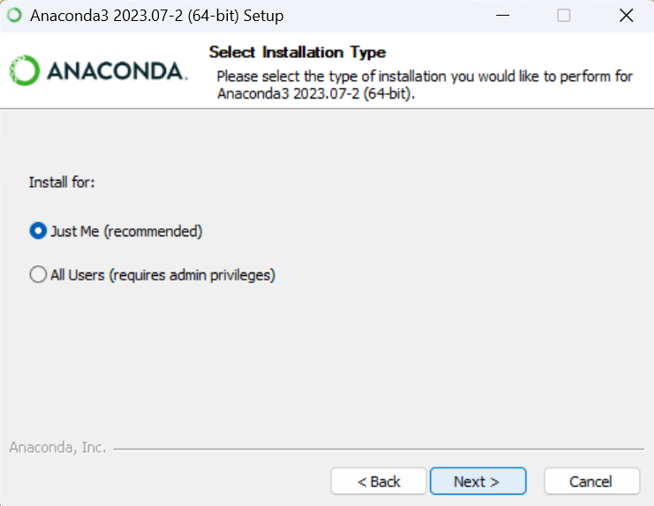
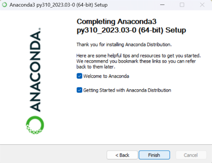
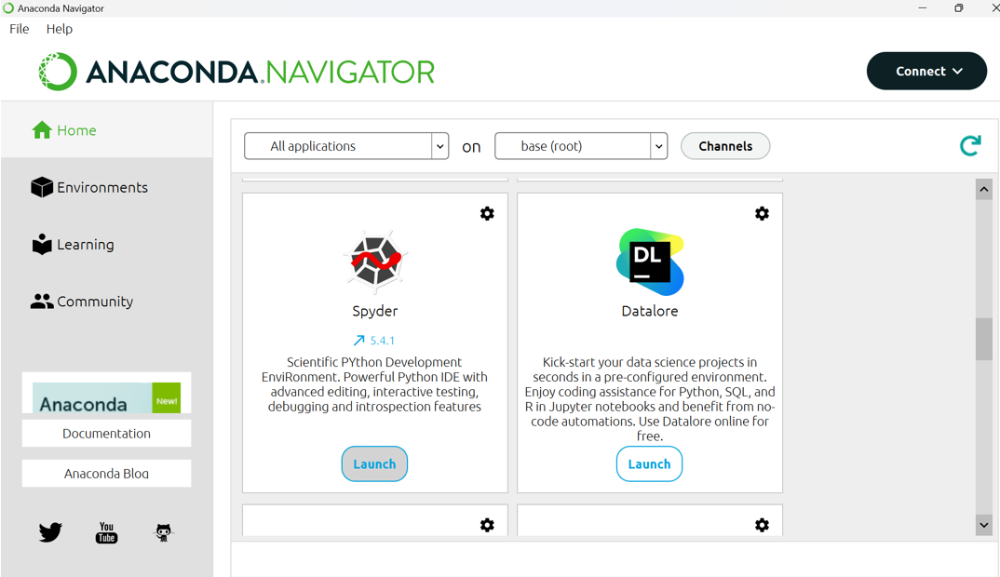
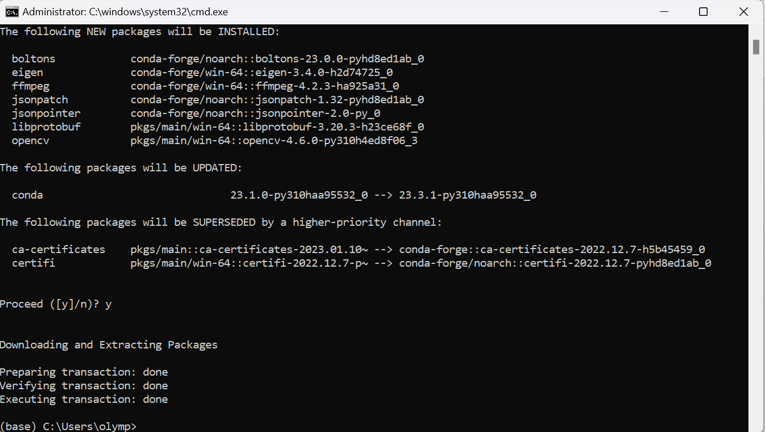

# Hands on AI in STEM

## Intro

Hier zal gebruik gemaakt worden van AI om een servomotor op de micro:bit aan te sturen. Er zal eerst een neuraal netwerk getrained worden met beelden. Beelden die we verzamelen via de webcam van de computer. Hoe meer beelden we nemen, hoe preciezer het neuraal netwerk zal werken. Binnen het neuraal netwerk (NN) zullen we een aantal klasse's opnemen (classificatie). Hoeveel klasses je nodig hebt hangt af van de toepassing. De aangeboden train beelden zullen we zelf toekennen aan een klasse. We werken hier dus met een **Supervised learning AI model** werken. De data geven we aan het NN en bij die data zeggen we (per beeld hier) het NN tot welk een klasse de data behoort. 

Het neuraal netwerk (NN) zal patronen zoeken en onderscheiden die specifiek zijn voor een bepaalde klasse.

Eenmaal het neuraal netwerk getrained is kunnen we dan een nieuw beeld aanbieden aan het NN die dan een beoordeling zal maken en een procentuele kans waarde zal genereren voor iedere klasse. De hoogste procentuele waarde zal bepalend zijn om het beeld tot die klasse onder te brengen. Let wel het nieuwe beeld levert geen meerwaarde aan het leerproces van het NN. Indien er geen voldoening is door de gebruiker dringt zich een nieuwe leerfase op met betere-meer train data. 

Het is dus duidelijk dat we zelf het NN niet zullen bouwen, maar we gebruiken een leeg bestaand NN om met onze specifieke data dit NN te trainen volgens onze toepassing. Wiml je een nieuwe toepassing, dan kan je dit opnieuw doen voor andere data.

Eenmaal we tevreden zijn van het getrainde NN (we zullen het ook testen, wat ook een belangrijke stap is in het gebruik van AI) gaan we dit volledige NN downloaden als een bestand op onze computer. Aan dit bestand kunnen we dan nieuwe data aanbieden, waarop het NN dan zijn werk zal doen en een output (procentuele classificatie).

Om dit te kunnen doen zullen we een beetje moeten programmeren. En python is hiervoor uitstekend geschikt. In dit programma zullen we toelaten dat we nieuwe data kunnen binnenhalen (in ons geval webcam beelden) en dat we die nieuwe data kunnen aanbieden aan het bestand met daarin ons getraind NN. Dit zal dus een output generen volgens de klasses die we in het NN hebben opgenomen. Daaruit zullen we de klasse halen die de hoogste 'confidence score' bezit. 

Ons python programma zal dan ook in staat moeten zijn om te kunnen communiceren met de microcontroller. In ons geval de micro:bit. Het python programma kan dan een unieke waarde doorsturen naar de microcontroller. De microcontroller kan die waarde binnen lezen en interpreteren. Volgens de interpretatie kan de microcontroller dan een actuator aansturen, in ons geval de positie van een servomotor.


## Stappenplan

Om een overzicht te houden volgt hier een opsomming van de te nemen stappen:
<ol>
<li>beelden verzamelen om het NN te trainen = train data (via webcam)</li>
<li>beelden classificeren</li>
<li>NN trainen</li>
<li>NN downloaden als bestand</li>
<li>python script schrijven met volgende mogelijkheden: </li>
<ol>
    <li>NN bestand importeren en gebruiken</li>
    <li>nieuwe webcam beelden kan aanleveren aan NN</li>
    <li>output van NN kan lezen en interpreteren</li>
    <li>communiceren met een microcontroller</li>
    <li>output van NN doorsturen naar microcontroller</li>
</ol>
<li>microcontroller leest data binnen</li>
<li>microcontroller stuurt actuator aan</li>
</ol>

We bespreken in volgende hoofdstukken deze stappen in detail. We gaan hier een voorbeeld uitwerken waarbij we met 3 klasses zullen werken:

<ul>
<li>klasse1 : beelden met een duim omhoog</li>
<li>klasse2 : beelden met een duim omlaag</li>
<li>klasse0 : beelden zonder zichtbare duim (of iets die niet klasse1 en niet klasse2 is)</li>
</ul>

Op basis van die beelden (classificaties) willen we de positie van een servo motor aansturen in drie posities: 

<ul>
<li>klasse1 : positie servo motor uiterst links</li>
<li>klasse2 : positie servo motor uiterst rechts</li>
<li>klasse0 : positie servo motor in het midden</li>
</ul>

<hr>

## Beelden verzamelen om het NN te trainen = train data (via webcam)

Hiervoor gebruiken we een online platform van Google. Dit platform voorziet lege neurale netwerken die je met uw eigen data kan trainen. Nadien kan je ook testen of uw NN geschikt is voor gebruik. Het platform is 'Teachable Machine' en is te vinden op:

<https://teachablemachine.withgoogle.com/>

Je hebt hiervoor een Google-account nodig. Log met die account in op 'Teachable Machine'. Nu kan je kiezen wat voor soort train-, test- en verwerk data je wenst te gebruiken. 

## Beelden classificeren

De gemaakte beelden zijn onmiddelijk in drie klasses gestopt volgens inhoud van de foto's:

<ul>
<li>klasse1 : beelden met een duim omhoog</li>
<li>klasse2 : beelden met een duim omlaag</li>
<li>klasse0 : beelden zonder zichtbare duim (of iets die niet klasse1 en niet klasse2 is)</li>
</ul>

## Neuraal netwerk trainen

Na het train proces kan er op de website onmidellijk worden getest met nieuwe data (nieuwe beelden). Ga hier na of in alle omstandigheden het neuraal netwerk goed reageert en classificeert. Indien dit niet ok is kan er opnieuw worden getraind met nieuwe / extra data. 

Eenmaal dit goed bevonden, kan dit worden opgeslagen in uw Google account. Dit is handig als er achteraf toch nog nieuwe trainingsdata zou moeten bijkomen. Je kan verschillende van die getrainde NN op de website opslaan.


## Volledig getraind Neuraal Netwerk downloaden als bestand

Het volledige getraind neuraal netwerk kan nu als bestand worden gedownload. Let wel, niet alle getrainde fotodata is hierin opgeslagen. Wel de herkende patronen die het NN toelaten om er een classificatie van te maken. Vandaar dat dit bestand niet zo groot is als je op eerste zicht zou verwachten.

Er zijn verschillende manieren om van dit NN een bestand te maken. Het Google model die hier gebruikt wordt is een Keras model van Tensorflow. Tensorflow is een Google onderdeel die zich specialiseert in AI. Op de website kunnen we dit NN als een keras model van Tensorflow downloaden. Dit levert een 'keras_model.h5' bestand op die we ergens op de lokale computer kunnen downloaden. Het volledige getrainde NN zit vervat in dit bestand.


## Python script schrijven

Nu moet er op de lokale computer een Python script wordt geschreven die volgende zaken doet:

<ol>
    <li>NN bestand importeren en gebruiken</li>
    <li>nieuwe webcam beelden kan aanleveren aan NN</li>
    <li>output van NN kan lezen en interpreteren</li>
    <li>communiceren met een microcontroller</li>
    <li>output van NN doorsturen naar microcontroller</li>
</ol>

Hiervoor wordt best gebruik gemaakt van een Python IDE (ontwikkelomgeving). Er wordt hier gebruik gemaakt van Spyder. Dit wordt best geïnstalleerd onder het pakket van Anaconda.

Ga naar de website van Anaconda en download de installer van Anaconda. Na het downloaden voer de installer uit:



Volg daarna standaard stappen (§zorg dat je Adminuisrator rechten hebt op de computer!!):










Reboot de computer

Start Anaconda Navigator

Select Spyder en Launch



Sluit Spyder en Anaconda volledige af en start de Navigator opnieuw met Administrator rechten!!!

### Installatie van OpenCV voor Anaconda

OpenCV is een Python blibliotheek die het programma in staat stelt om de webcam van de computer te gebruiken. Dit is trouwens nodig om nieuwe beelden te kunnen aanbieden aan het NN.

Start CMD.exe Prompt binnen Anaconda op:


 En voer het volgende commanda op de prompt uit:

```prompt
 conda install -c conda-forge opencv
```

 

 ### Install Tensorflow in Anaconda

 Om een Keras model van Tensorflow te kunnen gebruiken moet ook hiervoor een blibliotheek op de computer worden geïnstalleerd. Doe dit ook in de CMD.exe Prompt binnen Anaconda navigator (opnieuw met administrator rechten) :

```prompt
 conda create -n tf tensorflow
```


Bevestig met 'y'


Activeer deze bibliotheken met het commando:


```prompt
 conda activate tf
```


Voila, de computer is klaar om een python script te schrijven en te testen.


