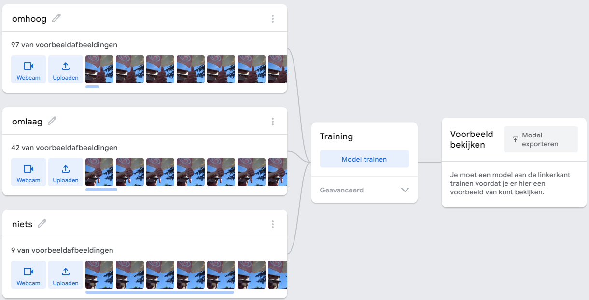
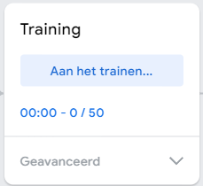
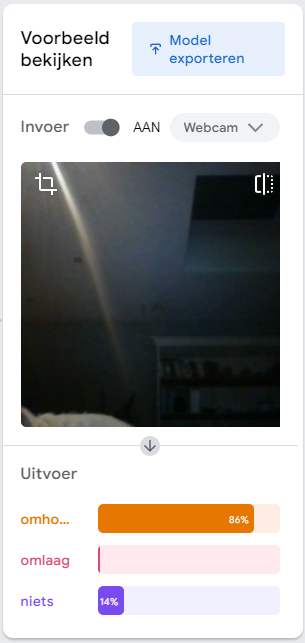
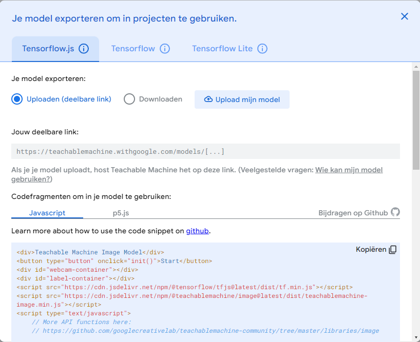
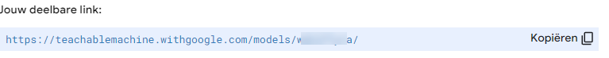
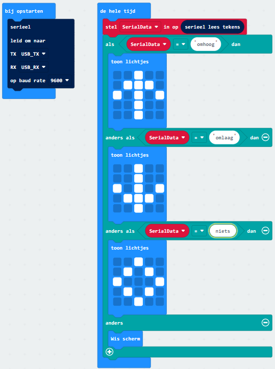
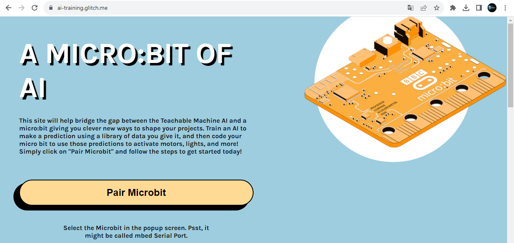
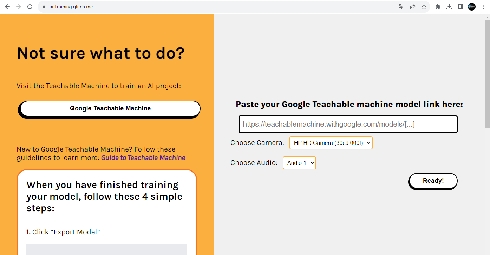

---
mathjax:
  presets: '\def\lr#1#2#3{\left#1#2\right#3}'
---

# SteamLabs

Indien de python (Anaconda) omgeving voor de gebruiker te hoog is gegrepen, kan een combinatie Teachable Machine met het aansturen van een Micro:Bit op een andere manier worden uitgerold. 

De procedure wordt hier besproken. Het leerproces binnen Teachable Machine blijft dezelfde. We vatten deze procedure aan net na het leerproces met zijn classificaties binnen Teachable Machine. Na het testen kan het getrainde neuraal netwerk worden gedownload. In plaats van het te downloaden op de lokale computer zullen we hier dit bewaren in de cloud met een toegankelijke link.
Deze link wordt dan verder gebruikt binnen een website die in staat is om nieuwe webcam beelden aan te bieden aan het getrainde neuraal netwerk. En daarbij is de website in staat om de classificatie (output van het neurale netwerk) door te sturen naar een geconnecteerde Micro:Bit.

## Teachable Machine

Klik op Model trainen

Eénmaal getraind kan het model getest worden.

Eenmaal dit ok is, kan het exporteren plaatsvinden. Klik hiervoor op Model exporteren.
Nu wordt hier echter gekozen voor een deelbare link. Dwz dat het neuraal netwerk in de cloud zal worden bewaard en is bereikbaar via een internet link.

Kies voor Upload Mijn Model

Als de link ter beschikking is, klik op Kopiëren.

Open in de browser een nieuw venster en surf naar de programmeeromgeving van Micro:Bit. En programmeer volgende scratch code:

:::warning
Let op bij de verschillende selecties naar de verschillende strings (omhoog, omlaag, niets). Vervang deze strings door de juiste naamclassificaties die je hebt gebruikt binnen teachable machine.
:::

Programmeer vorige code in de Micro:Bit.

Sluit de Browser en start die opnieuw op, en ga naar volgend linkadres:

[https://ai-training.glitch.me/](https://ai-training.glitch.me/)

Pair (verbinding maken) de Micro:bit door op de knop te klikken.

Plak de eerder gekopîeerde link vanuit teachable machine in dit venster.

Daarna zal via de webcam nieuwe beelden worden aangeboden aan het neuraal netwerk die op zijn beurt een communicatie met de Micro:Bit zal verzorgen door de namen van de verschillende classificaties door te sturen naar de Micro:Bit.

Voila, dit zou ook moeten werken.
