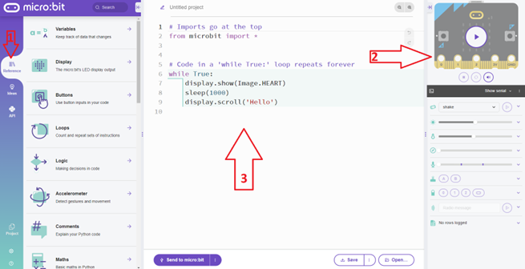
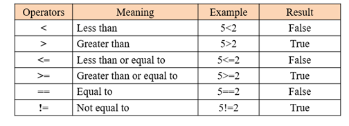

# Micro:Bit


---

## Introductie

De Micro:Bit is een microcontroller zoals er vele op de markt te verkrijgen zijn zoals Arduino, Nucleo, PIC, ... Deze worden heel frequent gebruikt zowel in industriële ontwikkeling, prototyping, als bij hobby-isten. De Micro:Bit is populair door zijn lage kostprijs, zijn laagdrempelige programmeeromgeving, de aanwezigheid van vele sensoren op de Micro:Bit, de veelheid aan demo en info op het internet. 

De Micro:bit is een geweldige manier om de basisprincipes van programmeren en informatica te leren. De Microsoft MakeCode-coderingsomgeving op basis van blokken is een krachtige en intuïtieve manier om de Micro:bit te laten reageren op allerlei soorten invoer, en u kunt fundamentele concepten zoals iteraties, voorwaardelijke instructies en variabelen introduceren met MakeCode.
Studenten richten zich vaak vooral op het 5x5 LED-scherm voor het leveren van output (actuator). Hoewel dit de meest direct toegankelijke manier is om een reactie op een of andere input te zien, zijn er veel meer creatieve mogelijkheden wanneer je je leerlingen aanmoedigt om de Micro:Bit te zien als een "brein" dat fysieke, tastbare creaties kan besturen.

Deze creaties hoeven niet complex of technisch hoogstaand te zijn. Het is geweldig om studenten te laten bouwen met gemeenschappelijke huishoudelijke benodigdheden. Omdat de Micro:bit zo licht is en zoveel sensoren ondersteunt, kan hij gemakkelijk in een fysiek ontwerp worden opgenomen, zolang studenten maar vooruit plannen voor de grootte en het gewicht. Een van de eerste vragen die je studenten zou kunnen stellen, is "Waar past de Micro:Bit in je creatie?"

De Micro:Bit kan in verschillende talen worden geprogrammeerd. De meest gebruikte programmeeromgeving voor kinderen in de Microsoft MakeCode editor. Met deze omgeving kan er online worden geprogrammeerd in 4 verschillende talen: Grafische blokken, MakeCode JavaScript, MakeCode Python. Wij zullen hier echter als initiatie hier de MicroPython gebruiken. Dit heeft het voordeel dat de gebruiker leert omgaan met de syntax van Python. In deze omgeving wordt een soort operating systeem geïnstalleerd op de Micro:Bit die volledig kan bestuurd worden met de standaard Python taal. 


## Activity: De programmeeromgeving

Er bestaan verschillende manieren om de Micro:Bit in de Python programmeertaal te programmeren. Dit kan via Visual Studio Code, dit moet je dan zelf downloaden en installeren op uw computer, maar er bestaat ook een online omgeving voor MicroPython voor de Micro:Bit. Op die manier hoef je niets te installeren op uw computer. Ga hiervoor naar de website : https://microbit.org/ en klik bovenaan op "Let's code" en kies op die pagina voor de link : Python editor.



Herken hierop:
<ol>
  <li>Reference : Python bibliotheek</li>
  <li>Simulator</li>
  <li>Programmeer Python code zone</li>
</ol>

## MicroPython code

Initialisatie : Omdat we werken met een Micro:bit moeten we dit steeds aangeven bovenaan de code.  Importeer steeds (*) om (bijna) alle (hardware)mogelijkheden van de Micro:Bit te gebruiken. Doe dit door bovenaan in de Python code te schrijven :

```python
from microbit import *
#Dan de rest van de python code
```

Binnen een programmeertaal zijn een aantal zaken belangrijk en keren steeds terug in andere programmeertalen. Dit zijn:
<ol>
  <li>Commentaar in Python begint met een #.</li>
  <li>Variabelen: reserveren van geheugenplaats om data (tijdelijk) in te bewaren</li>
  <li>Soorten variabelen : type : 
    <ul>
        <li>Getallen zonder komma: integer</li>
        <li>Getallen met komma: float</li>
        <li>Boolean: variabele die maar twee waarden kan bevatten: 1/0 of True/False </li>
        <li>String: variabele die tekst kan bevatten (groepering van characters) </li>
        <li>char: variabele die maar 1 character/symbool kan bevatten </li>
    </ul>
  </li>
  <li>Iteraties: herhalingen:
    <ul>
        <li>While Loop: herhaling die steeds wordt herhaald als voorwaarde True is (aantal loops is niet gekend)</li>
        <li>For Loop: herhaling die steeds wordt herhaald als voorwaarde True is (aantal loops is gekend)</li>
    </ul>
  </li>
  <li>Converties of type casting: omzetting van ene type naar een ander type variabele</li>
  <li>Concatenatie van strings: samenvoegen van twee strings tot 1 string (aan elkaar kleven)</li>
  <li>Maken van eigen functies met daarbij parameters en return waarden</li>
</ol>

## Iets meer over variabelen:

Tekst die bestaat uit meerdere tekens, omsloten door enkele of dubbele aanhalingtekens wordt een **string** genoemd . (“string”) </br>
Een getal kan een **integer** zijn (geheel getal) of een **float** (een komma getal)( Let op! moet een punt zijn i.p.v. een komma)</br>
Een **boolean** is een variabele die maar twee toestanden kent: 0 of 1 , soms wel als **False** en **True** uitgedrukt.  </br>
**Variabele :** We kunnen ook iets opslaan in het geheugen van de computer (= declaratie = reservatie van geheugenplaatsen). Aantal geheugenplaatsen is afhankelijk van het type variabele (int, float, string, bool). Een variabele krijgt steeds een (logische)naam die de programmeur zelf kan kiezen.


## Iets meer over iteraties:

Door Python code te schrijven kan een statement, instructie één keer worden uitgevoerd, door die code op te nemen in een While-True statement kan een oneindige herhaling worden gecreëerd waarbij dit statement telkens zal worden herhaald. (zie verder) 

## Micro:Bit specifieke MicroPython functies

Deze functies hebben specifieke bertrekking tot de onboard sensoren en actuatoren.

### Led matrix

```python
from microbit import *
display.show(<nummer>)
display.scroll(<nummer>)
display.show(Image( '90900:'#helderheid individuele LED's
                    '09990:'
                    '00909:'
                    '09090:'
                    '90090:'
                    ))
```
Toon hiermee 1 cijfer en experimenteer met getallen bestaande uit meerdere cijfers.

**Toon 1 keer een getal:**

```python
from microbit import *

display.scroll(1234)
```
**Herhaal telkens de weergave van een getal:**

```python
from microbit import *

while True:
  display.scroll(1234)
```


**Gebruik van een variabele:**

Je zou dit kunnen programmeren om eenmalig een getal te laten aftellen:
```python
from microbit import *
display.show(4)
sleep(500) #laat de microcontroller een beetje slapen 500 milliseconden - wacht om volgend statement uit te voeren
display.show(3)
sleep(500)
display.show(2)
sleep(500)
display.show(1)
sleep(500)
display.show(0)
sleep(500)
while True:
  display.show(Image( '90900:'
                      '09990:'
                      '00909:'
                      '09090:'
                      '90090:'
                    ))
  sleep(500)
  display.show(Image( '60600:'
                      '06660:'
                      '00600:'
                      '06060:'
                      '60006:'
                    ))
  sleep(500)

```
Als je de tussentijden wenst aan te passen, moet je nu overal de 500 aan passen naar een nieuwe waarde. Dit kan éénmalig met een variabele gebeuren.

```python
from microbit import *
wacht_tijd=500 #variabele met de naam wacht_tijd
                #en de inhoud ervan is een integer met waarde 500

display.show(4)
sleep(wacht_tijd) 
display.show(3)
sleep(wacht_tijd)
display.show(2)
sleep(wacht_tijd)
display.show(1)
sleep(wacht_tijd)
display.show(0)
sleep(wacht_tijd)

while True:
  display.show(Image( '90900:'
                      '09990:'
                      '00909:'
                      '09090:'
                      '90090:'
                    ))
  sleep(wacht_tijd)
  display.show(Image( '60600:'
                      '06660:'
                      '00600:'
                      '06060:'
                      '60006:'
                    ))
  sleep(wacht_tijd)
```

**Gebruik van een For-Loop:**

Stel dat je een aftelling wilt maken niet van 4 naar 0, maar van 1000000 naar 0. Dan wordt het programma onzinnig met een miljoen aan dezelfde statements.
Beter is hiervoor een FOR-loop (ook een herhalings iteratie) te gebruiken. In een For-loop is het aantal herhalingen gekend en wordt bijgehouden in een variabele die telkens met 1 wordt verminderd. 


```python
from microbit import *
wacht_tijd=500 #variabele met de naam wacht_tijd
                #en de inhoud ervan is een integer met waarde 500

for i in range (4): #herhaling van 4 keer 
                    #met gebruik van een integer 
                    #(teller)variabele met naam i
  display.show(i)
  sleep(wacht_tijd) 

while True:
  display.show(Image( '90900:'
                      '09990:'
                      '00909:'
                      '09090:'
                      '90090:'
                    ))
  sleep(wacht_tijd)
  display.show(Image( '60600:'
                      '06660:'
                      '00600:'
                      '06060:'
                      '60006:'
                    ))
  sleep(wacht_tijd)
```

::: tip
**Concatenatie:**
Is het samenvoegen (aan elkaar kleven) van twee string-type variabelen.
:::

```python
from microbit import *
tekst1 = "Hallo"
tekst2 = " wereld!"
samengevoegd1 = tekst1 + tekst2
```

::: tip
**Type casting:**
Is het converteren (omvormen) van een variabele naar een ander type (indien mogelijk).
:::

```python
from microbit import *
tekst = "6"
naarInteger = int(tekst)
```

### Communicatie µBit via USB kabel (via console/terminal) -statement: input - print

Het komt zeer veel voor dat er data moet worden uitgewisseld tussen de µBit en de buitenwereld. De meest eenvoudige buitenwereld is de computer waarop de µBit is op aangesloten via een USB kabel. Deze wordt gebruikt om de µBit te programmeren. Maar ook tijdens het runnen van een programma op de µBit is er soms nood om te communiceren met het programma op de µBit. Dit kan in twee richtingen. Data van µBit naar computer (**print**), of data van de computer naar de µBit (**input**). Volgend voorbeeld toont beide mogelijkheden in volgende stappen: 
<ul>
<li>µBit vraagt (<b>input</b>) aan de computer de naam van de gebruiker</li>
<li>µBit slaat die string op in een variabele</li>
<li>µBit zend (<b>print</b>) die inhoud van die variabele terug naar de console</li>
<li>µBit vraagt (<b>input</b>) aan de computer om een getal in te geven</li>
<li>µBit slaat die string (let op : getal wordt hier gezien als een string!!) op in een variabele</li>
<li>µBit zal die laatste string-variabele omvormen naar een integer-variabele om het  aantal keer een For-Loop moet worden doorlopen.</li>
</ul>

::: warning
Let op in de code: het inlezen (input) is steeds van het type String. Aangezien we dit als een getal willen gebruiken moet hier dus een typecasting gebeuren van een string naar een integer. Let wel, dit kan fout lopen indien er geen omzetbaar symbool wordt ingegeven.
:::

```python
from microbit import *

name=input('Wat is uw naam? ')
print('Hallo', name)
aantalKeer=input('Geef een getal: ')
for i in range(int(aantalKeer)):
  display.show(Image.HEART)
  sleep(250)
  display.show(Image.HEART_SMALL)
  sleep(250)
  display.clear()
  
```


### Gebeurtenis op basis van drukknoppen

Binnen de oneindige WHILE-loop kan er steeds nagegaan worden of een drukknop is ingedrukt. Hiervoor gebruiken we een IF-statement (keuze optie: levert altijd een True/False op). Een IF-statement kan op verschillende manieren worden gebruikt, zo is er ook een ELSE mogelijkheid, of zelfs combinaties. We houden het hier eenvoudig.

Binnen de MicroPython van de Micro:Bit kan gebruik gemaakt worden van:

**WAS_pressed**: statements worden slechts één keer uitgevoerd (ook bij blijvend drukken).
**IS_pressed**: statements worden meerdere keren uitgevoerd bij blijvend drukken.


```python
from microbit import *
while True:
  if button_a.was_pressed():
    display.scroll('knopA')
  if button_b.is_pressed():
    display.scroll('knopB')
```
::: tip
Blijf eens op een knop drukken om het verschil te zien in voorgaande.
:::


Een IF-statement werkt heel veel samen met vergelijkingsoperatoren.

### Vergelijkingsoperatoren



Iets uitvoeren als er op beide wordt gedrukt:

```python
from microbit import *
while True:
  if button_a.is_pressed() and button_b.is_pressed():
    display.scroll('knopA&B')
```

Er zijn dus vier combinaties met twee drukknoppen:
notA and notB / A and notB   / notA and B   / A and B
Dit behoort tot de logische operatoren.

### Logische operatoren


Vier toestanden met twee drukknoppen:

```python
from microbit import *
while True:
  if button_a.is_pressed() and button_b.is_pressed():
    display.show('A&B')
  if (button_a.is_pressed() and (not button_b.is_pressed())):
    display.show('A')
  if (not(button_a.is_pressed()) and (button_b.is_pressed())):
    display.show('B')
  if (not(button_a.is_pressed()) and (not button_b.is_pressed())):
    display.show('0')
```

**Tellen en weergeven van het aantal keren gedrukt op knop A**

Hier gaan we het aantal kliks op drukknop A bijhouden in een variabele (integer) met de naam teller. Telkens als er op de drukknop A wordt gedrukt moet de waarde van teller uit het geheugen gehaald worden (lezen), en moet daar 1 bij opgeteld worden. Daarna schrijven we het resultaat van die optelling terug naar het geheugen in dezelfde variabele teller (klaar voor de volgende klik).
Teller kan gereset worden door op drukknop B te drukken.

```python
from microbit import *
#declaratie van de teller variabele 
#en initialisatie op 0
teller = 0
while True:
  if button_a.was_pressed():
    teller = teller + 1
  if button_b.was_pressed():
    teller = 0
  display.scroll(teller)  
```


